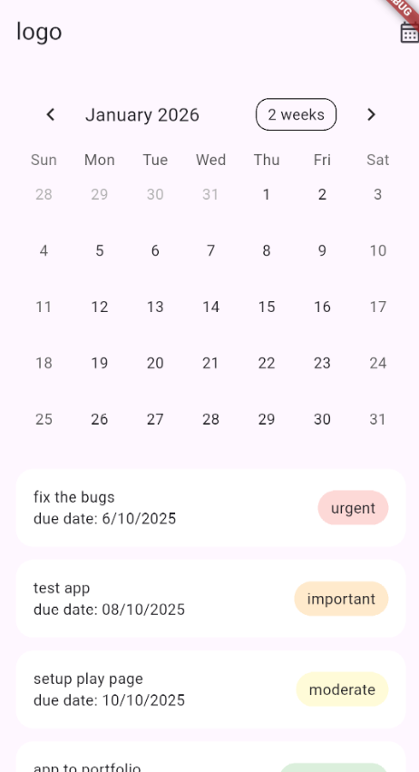

# UI_Flutter_todo_list

A simple Flutter task management app with calendar integration.

## Features

- Interactive calendar view
- Task list with priority labels
- Due date tracking
- Clean and minimal UI

## Screenshots



## Getting Started

### Prerequisites

- Flutter SDK (3.0 or higher)
- Dart SDK
- Android Studio / Xcode (for mobile development)

### Installation

1. Clone the repository
```bash
git clone https://github.com/yourusername/task-calendar-app.git
cd task-calendar-app
```

2. Install dependencies
```bash
flutter pub get
```

3. Add your logo image to `assets/logo.png`

4. Run the app
```bash
flutter run
```

## Dependencies

- [table_calendar](https://pub.dev/packages/table_calendar) - Calendar widget

## Project Structure

```
lib/
  └── main.dart          # Main application file
assets/
  └── logo.png           # App logo
```

## Usage

- Tap on any date in the calendar to select it
- View your tasks below the calendar
- Tasks are color-coded by priority:
  - Red: Urgent
  - Orange: Important
  - Yellow: Moderate
  - Green: Nice to have
  - Blue: Exploration

## License

This project is open source and available under the [MIT License](LICENSE).

## Contributing

Pull requests are welcome. For major changes, please open an issue first to discuss what you would like to change.
